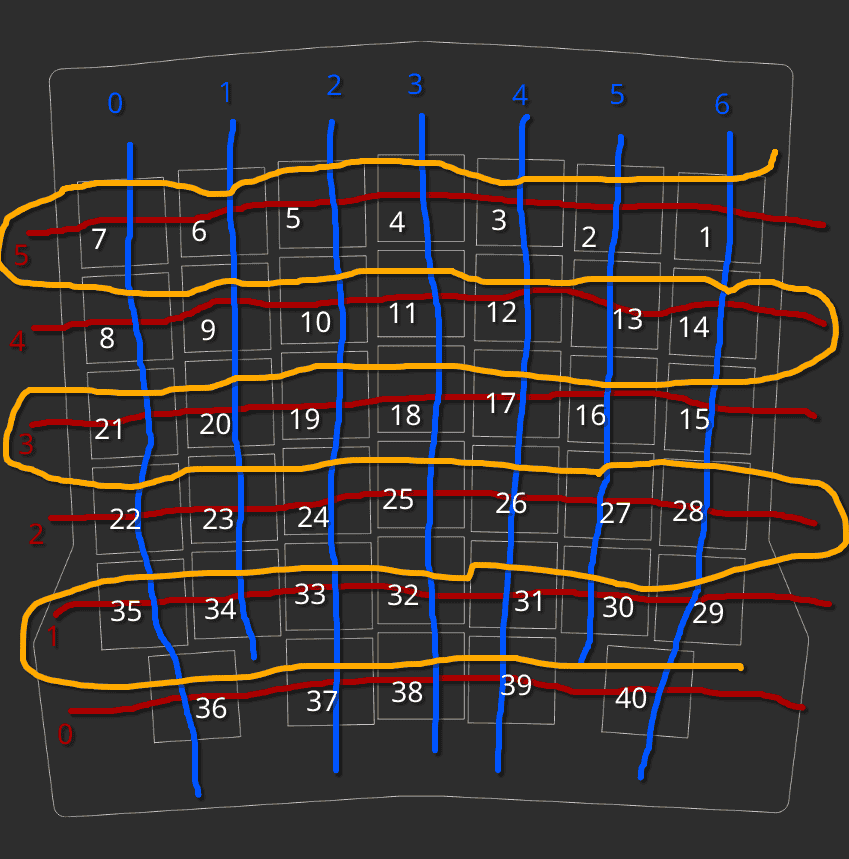
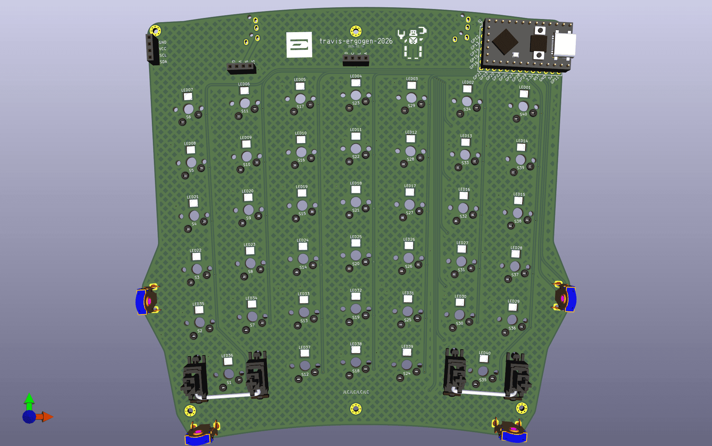

# Travis's Ergogen v2026
This is a split keyboard with 2 ortholinear symmetrical 40-key halfs made with Ergogen v4. Multiple positions for an i2c OLED and mousewheel encoder. TRRS for connecting halfs, firmware not updated for that yet though.





## Parts:

JLCPCB SMD components (40 each per board):
* capacitor C710467
* diode C7420318
* RGB LED C5378731
* MX C41430893

Other parts:
* MCU: RP2040 Community Edition
* capacitor 6.3V 1000uF
* resistors 510k ohm (2 per board)
* 2u stabilizers (2 per board)
* TRRS PJ-320A jacks (2 per board if connecting)
* mousewheel encoder (like Alps-EC10E1220501)
* OLED i2c
* MX switches (40 per board)
* low-profile sockets/pins for MCU & OLED


## References:
My previous ergogen abominations:
* [travis-ergogen-numpad](https://github.com/dieseltravis/travis-ergogen-numpad)
* [travis-ergogen-2024](https://github.com/dieseltravis/travis-ergogen-2024)

### Footprints:
* https://github.com/ceoloide/ergogen-footprints
* https://github.com/dieseltravis/ergogen-footprints-travis

## Tips:

### Font used:
```
brew install --cask font-3270-nerd-font
```
https://www.nerdfonts.com/font-downloads


### Routing widths used:
```
"track_widths": [
        0.0,
        0.254,
        0.3556,
        0.508,
        1.27
      ],
```


### For STL arcs
It is buggy, set toJscadScript's maxArcFacet in Ergogen's cases.js, example locations on my machine:
```
./node_modules/ergogen/src/cases.js
~/.local/share/mise/installs/node/24.13.0/lib/node_modules/ergogen/src/cases.js
```
Note: the arcs are *super* glitchy in STLs


### For weird `node\r:` error:
```
find ./node_modules/ -type f -print0 | xargs -0 dos2unix --
```


## TODO:
* ~board: make those weird bottom shapes nicer~
* plate: print a 2u stab test key
    * ~print a top key test to measure for interference with i2c~
* ~i2c: if plate doesn't interfere with bottom ones remove top ones~
    * ~trrs: if top ones are removed, move left trrs to left side~
* case: just use flat one, arcs get too glitchy
* ~routing~
* ~bom: use [kicad-jlcpcb-tools plugin](https://github.com/Bouni/kicad-jlcpcb-tools)~
* ~leds: generate positions~
* ~qmk firmware~
    * ~via support~
* then arrowpad
